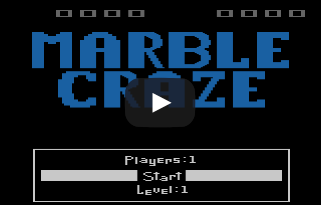
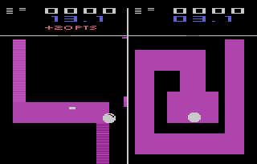
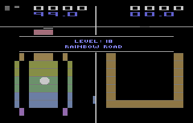

# Marble Craze

A game for the Atari 2600 console inspired by Atari's Marble Madness and Labyrinth, the wooden maze game played with steel marbles. Includes simultaneous two player mode, 18 levels, background music, hidden areas.  

The game is written in 6507 assembly and is notable for its innovative music driver and use of dual-paddle controllers for each player. Reading analog paddle controllers on the Atari 2600 takes away significant CPU time from graphics processing which made the game's display kernel design especially challenging.  Like many Atari 2600 cartridges, Marble Craze uses bankswitching to overcome the Atari 2600's limitation of only being able to address 4K on the cartridge port.

 

## Playing The Game

Cartridges are available from [Atariage](https://atariage.com/software_page.php?SoftwareID=3699) and the ROM ([mc_ntsc_7_26_3.bin](bin/releaseVersion/mc_ntsc_7_26_3.bin)) can be played on the Stella emulator or on real Atari 2600 hardware using a Harmony Cart or similar.  It is recommended to play the game with two real Atari paddle controllers since the game is very difficult with any other controller scheme.

## Instruction Manual

The manual is available here: [page 1](manual/mcman1.jpg) [page 2](manual/mcman2.jpg) [page 3](manual/mcman3.jpg) [page 4](manual/mcman4.jpg) 

## Building From Source

I use the [DASM assembler](http://dasm-dillon.sourceforge.net/) (old DOS/Win version is included), and there is also a C program included in the project that helps assemble the level data from text files.  There are DOS batch files in the tools folder to help build, although the tools and batch files need their paths adjusted.  From what I recall, some level data is hand-optimized to fit into the available space, and so it may not be easy to edit or create new levels.

## Copyright

©2002-2018 Paul Slocum, All rights reserved.  Source, binary, and files (other than [DASM](http://dasm-dillon.sourceforge.net/)) provided for personal use only.  Will likely eventually switch to an MIT license.

